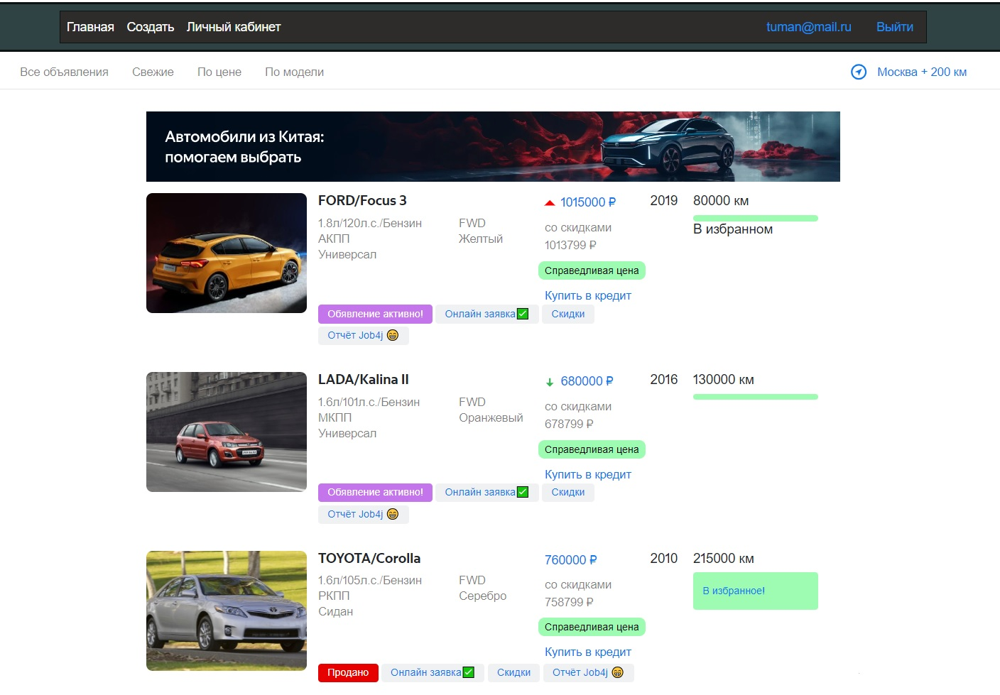

# "АвтоМаг"
## проект курса job4j по теме Hibernate

### В проекте используется:
* Java 17
* Spring Boot 3.1
* Hibernate 5.6
* PostgreSQL 14
* Thymeleaf, Bootstrap
* Liquibase
### Требования к окружению:
* Java 17
* Maven 3.8.6
* PostgreSQL 14, Git.

### Запуск приложения:

1. Клонируем проект "git clone https://github.com/boris86msk/job4j_cars"

2. В PostgreSQL необходимо создать базу данных "autoshop".

3. Для сборки проекта и запуска миграций в базу данных в корне проекта выполняем команду "mvn install".

4. Для запуска 
приложения из консоли выполняем команду "java -jar target/job4j_cars-0.0.1-SNAPSHOT.jar". В браузере приложение будет доступно по адресу
http://localhost:8083/index

5. Если при попытке запуска приложения в консоли появляется ошибка "Web server failed to start. Port 8083 was already in use",
вам необходимо в проекте открыть файл src/main/resources/db/liquibase.properties и изменить настройки порта на свободный в параметре "server.port=....".
Далее необходимо повторно собрать проект в maven и запустить.

### О приложении:
Приложение создано по образу популярных платформ по продаже автомобилей, но не повторяет их полный функционал и логику продаж, т.к. основная цель
это демонстрация возможностей фрейворка Hibernate. 
Для входа в систему вы должны зарегистрироваться. Пользователь может просматривать имеющиеся посты о прадаже авто и добавлять их в "избранное", размещать собственные
и редактировать их.

Оснавная страница, список всех постов. Краткая информация об авто, динамика цены, статус объявления

Страница с подробной информацией.

Страница с подробной информацией для владельца.

Личный кабинет.

Страницы входа ирегистрации.

